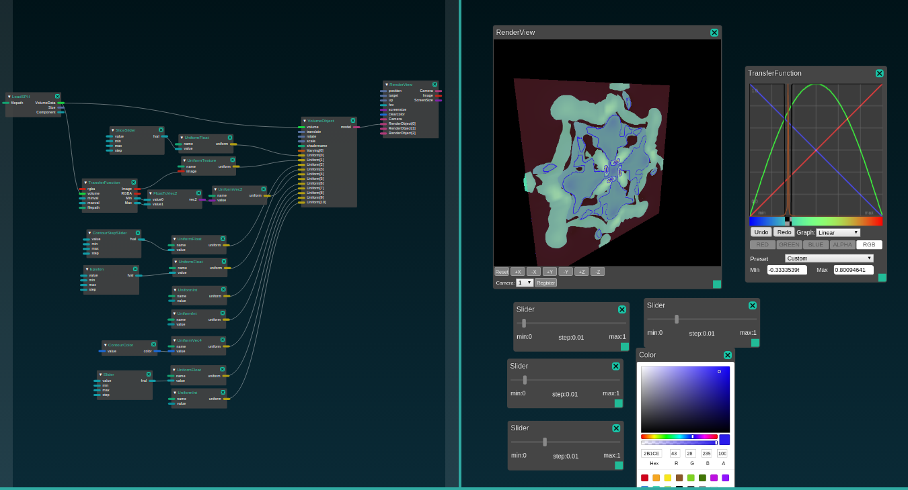
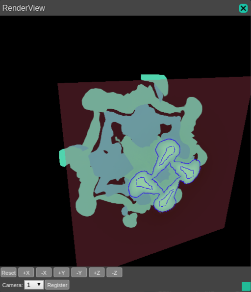

# Cross-section Contour Shader

Volumeの断面と断面におけるボリュームの等値線を描画するシェーダ

## Usage
- `shader/volume_contour.frag`を`${HIVE_ROOT}/build/bin/ModuleSystem/shader`に配置する。
- Hive Module Systemを起動し、cross-section_contour.jsonを読み込む。

## Shader Parameters
| Parameter    | type | range | Description |
|:-------------|:------|:------|:-----|
| u_tfTexture | Texture | | Transfer Functionのテクスチャ。 |
| u_volumeMinMax | vec2 | | ボリュームの最小値と最大値。 |
| u_contourStep| float| 0 ~  | 等値線の間隔を設定する。例えば0.1に設定すると0.1ごとのボリュームの値で等値線を描画する。 |
| u_contourEps | float | 0 ~ | 等値線の閾値を設定する。値が大きくなると等値線は太くなる。0.13あたりがちょうどよい。 |
| u_contourColor | vec4 | 0 ~ 1 | 等値線の色を設定する。 |
| u_flipSlice  | int | 0 (OFF) or 1 (ON) | 断面の方向を裏返す。 |
| u_sliceRatio | float | 0 ~ 1 | 断面の位置を割合で指定する。 |
| u_sliceAxis  | int | 0 (x), 1 (y), or 2 (z) | 断面の軸を切り替える。 |
| u_planeAlpha  | float | 0 ~ 1 | 断面のアルファ値を設定する。 |
| u_useComplementColorForPlane | int | 0 (OFF) or 1 (ON) | 断面の色にTransfer Functionで指定された色の補色を使用する。 |