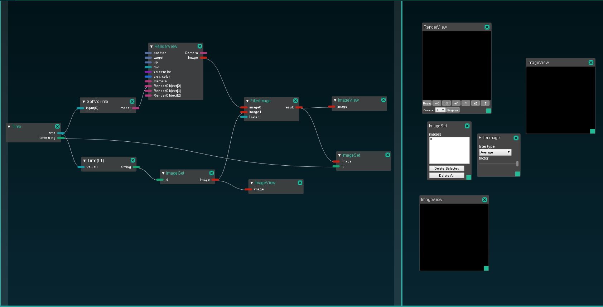
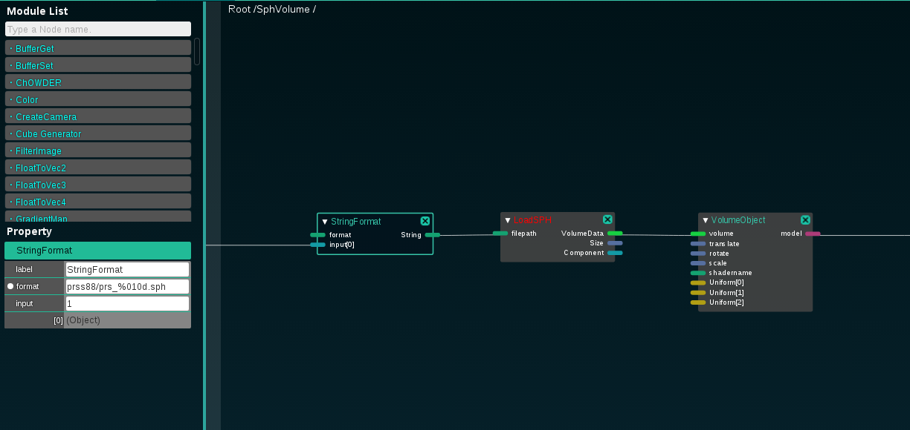
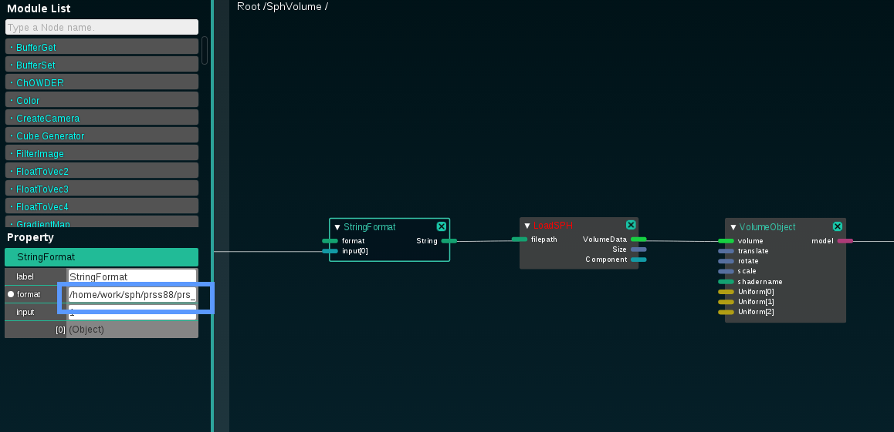
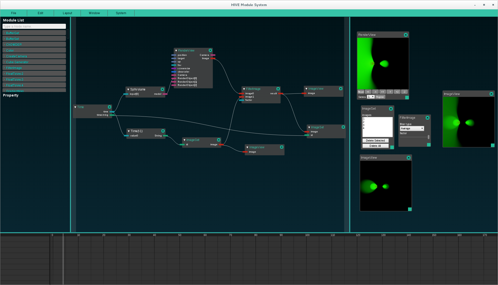

# RGBA averaging using ModuleSystem UI 

ModuleSystemのUIを用いたRGBA画像平均化のサンプルについて記載する. 
このサンプルでは連番sphファイルをレンダリングし, 画像平均化を行う.

# 使用方法
1. ModuleSystemで, rgba_average.jsonを読み込む.

2. SphVolumeノードをダブルクリックし, 中身を表示する.

3. StringFormatノードのformatプロパティに, 連番sphファイルに該当するパスを入力する
(確認時は,  /home/work/sph/prss88/prs_%010d.sph を使用した)

4. タイムラインのフレームを, 1フレームずつ動かすと, sphファイルがレンダリングされ,
1フレーム前のレンダリング画像とRGBA画像平均化が行われる. 

# ノードの詳細

HIVE/doc/hive_module_rgba.md にAPI含めた詳細を記載している