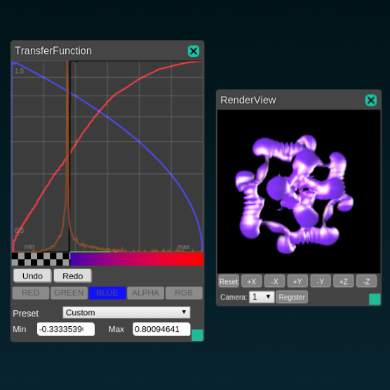
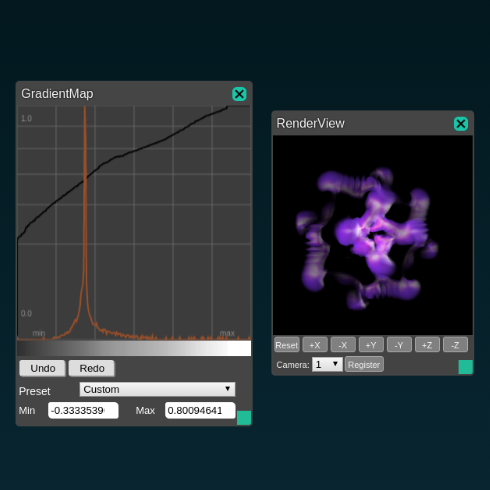
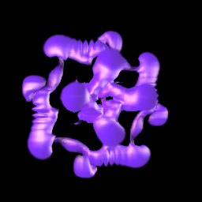

# volume rendering shader and ModuleSystem UI 

Volume rendering logic was ported from V-isio shaderVolren.

To use this example, please first replace assert paths(e.g. `/home/user/tools/HIVE/hrender/test/fvel_0000001470.sph`) in volren.json.

## UIs

* Transfer function(color map)
* Gradient map(monochrome version of transfer function)
* Lighting UI

## Rendering parameters

These are shading/rendering parameters(textures/uniforms) passed to `shader/volume_raymarch_rvr.frag`

* sampler2D tf_tex ... transfer function
* float tf_min
* float tf_max
* vec3 u_offset ... ボリュームの位置のオフセット
* float u_enableGradientMap ... gradient mapの使用の切り替え (0 or 1)
* sampler2D u_gradTex ... gradient map
* float u_samples ... レイマーチングのサンプル数
* float u_enableLighting ... ライティングの切り替え(0 or 1)
* vec3 u_light ... 光源の位置と強さ(posX, posY, posZ, intensity)
* vec3 u_attenuation ... 光の減衰(const, linear, quadratic)
* vec3 u_ambient ... 環境光成分 (R, G, B) [0, 1]
* vec3 u_specular ... スペキュラ (R, G, B) [0, 1]

### Transfer Function

Imageをtf_texに, MinとMaxをtf_min, tf_maxにつなげる

   
ボリュームの濃度が[0, 1]に正規化され, Transfer Functionのテクスチャを参照し, 色をつける. 
  

### Gradient Map

u_enableGradientMapノードにより, Gradient Mapの有無を設定する. 

  

### Lighting

u_enableLightingノードにより, ライティングの有無を設定する. 

   

u_light
光源の位置とスペキュラの強さを設定する. 
値が大きくなるほどスペキュラは弱くなる. 

  
u_light (0, 0, 50, 100)

u_attenuation
減衰を設定する
定数減衰, 一定減衰, 二次減衰
[1, 0, 0]の時減衰なし. 
   

u_specular
鏡面反射成分を0から1の範囲で設定する. 
デフォルトは1

u_ambient
環境光成分を0から1の範囲で設定する. 
デフォルトは0.2

## Other Parameters

- u_samples
ボリュームのサンプル数
多いほど綺麗にレンダリングできるが時間がかかる. 
   

- u_offset
ボリュームの位置をずらす

EoL.

