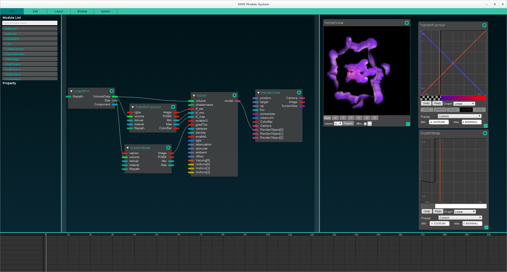
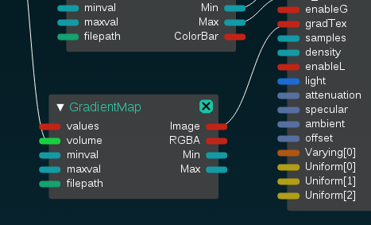

# Volume Rendering Shader and ModuleSystem UI 

ボリュームレンダリングシェーダとModuleSystemのUIを用いたパラメータの制御について記載する. 

----

ボリュームレンダリングの処理はV-isioのshaderVolrenから移植した. 
このシェーダでは次の項目をModuleSystemのUIで操作することができる. 
* Transfer function (color map)
* Gradient map
* Lighting

## Usage
まず, volren.jsonのsphデータのパスを編集し, 
(e.g. `/home/user/tools/HIVE/hrender/test/fvel_0000001470.sph`), ModuleSystemで読み込む. 
ノードの配置図とUIは次のようになる.  

## Rendering Parameters

レンダリングのパラメータには以下のものがある. 

| Type        | Name                | Default         | Description                                    |
| ----------- |:-------------------:|:---------------:|:----------------------------------------------:|
| sampler2D   | tf_tex              |    -            | Transfer Functionの色テーブル                   |
| float       | tf_min              |    -            | ボリュームの濃度の最小値                         |
| float       | tf_max              |   -             | ボリュームの濃度の最大値                         |
| float       | u_enableGradientMap |  1              | Gradient Mapの有無 (0 or 1)                     |
| sampler2D   | u_gradTex           | -               | Gradient Mapの色テーブル                         |
| float       | u_enableLighting    | 1               | ライティングの有無 (0 or 1)                      |
| vec4        | u_light             | (0, 0, 50, 5)   | 光源の位置と強さ (posX, posY, posZ, specular)    |
| vec3        | u_attenuation       | (1, 0, 0)       | 光の減衰 (const, linear, quadratic)              |
| vec3        | u_ambient           | (0.2, 0.2, 0.2) | 環境光成分 (R, G, B) [0, 1]                      |
| vec3        | u_specular          | (1, 1, 1)       | 鏡面反射成分 (R, G, B) [0, 1]                    |
| float       | u_samples           | 100             | レイマーチングのサンプル数                        |
| vec3        | u_offset            | (0, 0, 0)       | ボリュームの位置のオフセット                      |

### Transfer Function
TransferFunctionノードにはVolume LoaderからVolumeDataを接続する. 
また，filepathにlutファイルを指定することでTransfer Functionをインポートすることができる．lutファイルは後述するSaveColorMapノードで保存したものや，Visioからエクスポートしたものを用いることができる．  
TransferFunctionノードからはImageをtf_texに, MinとMaxをtf_min, tf_maxのUniform変数に接続して使用する.   
   
Transfer Functionではボリュームの濃度が0から1に正規化され, その値で色テーブルを参照し, 色をつける. 
下の画像では濃度が高い値が赤, 低い値が青となっている.   
  
橙色のヒストグラムはボリュームのデータにおいて, 同じ値が多い部分を表している. 
ヒストグラムを参考に, データが多い部分のアルファ値を低くすると, 特徴を抽出することができる.   
  
SaveColorMapノードを以下のように繋ぐことで，設定したTransfer Functionをlutファイルとしてエクスポートすることができる．エクスポートしたファイルはMosuleSystemやVisioで読み込むことができる．  
  
関連するUniform変数には次のものがある．
- Sampler2D tf_tex  
  Transfer Functionの色テーブル
  
- float tf_min  
  ボリュームの濃度の最小値
  
- float tf_max  
  ボリュームの濃度の最大値

### Gradient Map

GradientMapノードにはVolume LoaderからVolumeDataを接続する. 
また，Transfer Functionと同様にして，lutファイルをインポートすることができる．   
GradientMapノードからはImageをu_gradTexにUniform変数に接続して使用する. 

  
Gradient Mapではボリュームの濃度の勾配の大きさによって, 色テーブルを参照し, 得られた値をボリュームの透明度にかけ合わせる.   
    
右側の画像では勾配が小さい部分の不透明度を小さくすることで, 勾配が大きい部分を目立たせた.   

SaveGradientMapノードを以下のように繋ぐことで，設定したGradient Mapをlutファイルとしてエクスポートすることができる．エクスポートしたファイルはMosuleSystemやVisioで読み込むことができる．  
  

関連するUniform変数には次のものがある．
- float u_enableGradientMap (0 or 1)  
Gradient Mapの有無を設定する. 

- sampler2D u_gradTex  
Gradient Mapの色テーブル

### Lighting

ライティングは五つのUniform変数で制御される. 

- float u_enableLighting (0 or 1)  
ライティングの有無を設定する.   
   
左側はライティングなし, 右側はライティングありでレンダリングした. 

- vec4  u_light (x, y, z, specular)  
光源の位置と鏡面反射成分の強さを設定する. 
ボリュームは設定された位置と, その反対の位置(-u_light.xyz)の二箇所から照らされる. 
specularの値が大きくなるほど照り返しは弱くなる. 
デフォルトは(0, 0, 50, 5)  
      
左から(0, 0, 50, 100), (0, 0, 50, 10), (0, 0, 50, 5).

- vec3 u_attenuation (定数減衰, 一次減衰, 二次減衰)  
減衰を設定する. 減衰は点から光源までの距離dを用いて次のように計算される.   
float attenuation = 1. / (u_attenuation.x + u_attenuation.y * d + u_attenuation.z * d * d);  
デフォルトは(1, 0, 0).  
    
左から(1.2, 0.01, 0.001), (1.2, 0.01, 0), (1, 0, 0).   

- vec3 u_specular (r, g, b)  
鏡面反射成分を0から1の範囲で設定する. デフォルトは(1, 1, 1).  
    
左から(0,  0,  0), (0.5, 0.5, 0.5), (1, 1, 1).  

- vec3 u_ambient (r, g, b)  
環境光成分を0から1の範囲で設定する. デフォルトは(0.2, 0.2, 0.2).  
    
左から(0,  0,  0), (0.2, 0.2, 0.2), (0.4, 0.4, 0.4).  

## Other Parameters
その他に二つのレンダリングパラメータが存在し, Uniform変数で制御される. 
- float u_samples  
ボリュームのサンプル数を設定する. 多いほどレンダリングに時間がかかるが, 品質はあがる.
デフォルトは100.   
   
左側の画像はサンプル数50, 右側の画像はサンプル数300でレンダリングされた. 

- vec3 u_offset (x, y, z)  
ボリュームの描画位置をずらす. 

