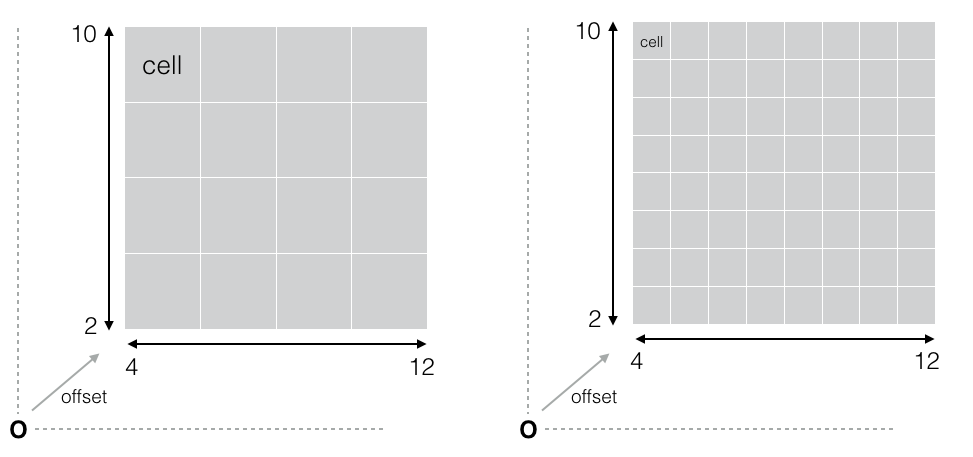
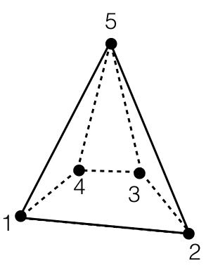
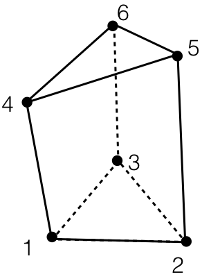
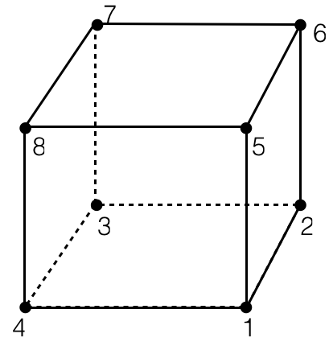

# Buffers in HIVE.

## BufferData

`BufferData` is the general data buffer in HIVE, and all renderable primitives and image buffer are derived from this class.

### BufferImageData

Represents buffer for image data.

### BufferMeshData

`BufferMeshData` represents polygon(triangle) primitive
`BufferMeshData` could have face indices, material ids and normals.
Optionally, `BufferMeshData` could have `BufferExtraData`, which holds arbitrary scalar/vector variables for each vertex in `BufferMeshData`(similar to glVertexAttributes).

### BufferPointData

`BufferPointData` represents point primitive.
`BufferPointData` could have indices, material ids and per-point radius.
`BufferPointData` is rendererd as a sphere with a radius in SURFACE.

### BufferLineData

`BufferLineData` represents line primitive.
`BufferLineData` could have indices, material ids and per-vertex radius(it can have different radius for start and end vertex).
`BufferLineData` is rendererd as a cylinder in SURFACE. 

Cylinder is rendered with capping by default in SURFACE. It can be controlled with `lsgl_LineCap` uniform variable.

For example, `glUniform1i(glGetUniformLocation(prog, "lsgl_LineCap"), 0);` will disable capping for cylinder.

### BufferVectorData

`BufferVectorData` represents vector arrow primitive. Its composed of a tetra primitive and a line primitive.

### BufferVolumeData

`BufferVolumeData` represents single uniform and non-uniform cartesian volume primitive(simiar to 3D texture).

### BufferSparseVolumeData

`BufferSparseVolumeData` represents sparse and multiresolution volume primitive(simiar to 3D sparse texture).

`BufferSparseVolumeData` is the container of volume blocks. volume block are represented as RAW volume data(for In-Situ visualization. No memory management by HIVE) or `BufferVolumeData`(Memory is managed by HIVE).

Each volume block is represented with the following fields.

| Parameters              | Type          | Description                                                |
| ----------------------- | ------------- | ---------------------------------------------------------- |
| offset                  | int[3]        | Offset of volume block in the integer local coordinate.    |
| extent                  | int[3]        | Extent of volume block in the integer local coordinate.    |
| size                    | int[3]        | Cell size of volume block(actual voxel data size)          |
| level                   | int           | LoD level(0 = finest)                                      |
| isRaw                   | bool          | true = use RAW volume data, false = use `BufferVolumeData` |

`extent` must be dividable by `size`. `level` is optional value but usually `level` is set so that `extent = size * (1 << level)`.

(Illustrated as 2D for the explanation)

For example, in the left image, a volume block has offset `(4, 2)`, extent `(8, 8)`, size `(4, 4)` and level `1`.
In the right image, a volume block has offset `(4, 2)`, extent `(8, 8)`, size `(8, 8)` and level `0`.

Note that global transformation is applied in Model representation level(e.g. `SparseVolumeModel::SetTranslate` method)

### BufferTetraData

Represents the list of tetra primitives. Tetra primitive is composed of 4 vertices(`TETRA_4` in CGNS).

For tetra primitive, the definition of vertex ordering is followed by the definition in CGNS http://cgns.github.io/CGNS_docs_current/sids/conv.html.

### BufferSolidData

For solid primitive, the definition of vertex ordering is followed by the definition in CGNS http://cgns.github.io/CGNS_docs_current/sids/conv.html.

#### Pyramid

BufferSolidData with type 5 reprensents Pyramid primitive and its composed of 5 vertices(`PYRA_5` in CGNS).

Planes composed by Pyramid pritimive must be all coplanar.

#### Prism

BufferSolidData with type 6 reprensents Prism primitive and its composed of 6 vertives(`PENTA_6` in CGNS)

Planes composed by Prism pritimive must be all coplanar.

#### Hexa

BufferSolidData with type 8 reprensents Hexahedron primitive and its composed of 8 vertives(`HEXA_8` in CGNS)

Planes composed by Hexa pritimive must be all coplanar.

