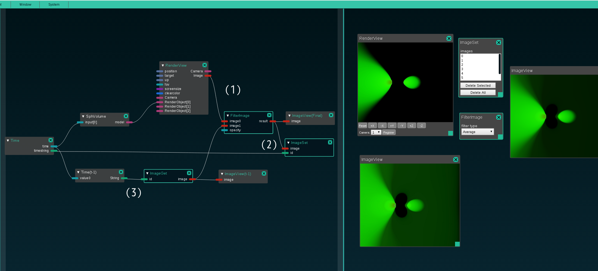

# Hive/ModuleSystem RGBAデータ操作モジュール

ModuleSystemのRGBAデータ操作モジュールを使ったピクセル平均化について記載する。

----

## シーン内RGBAデータ操作機能(モジュール)

 - 以下のインメモリバッファ操作用関数を使用して、１フレーム前のバッファを保存・取得できる
	- setBufferData
	- getBufferData
	- getBufferDataNames
	- deleteBufferData
	- clearBufferData
 - 関数の詳細はscene_script_interface.mdを参照

 - 1フレーム前のレンダリング画像データを取得する例を記載する。
   - 最終結果画像をsetBufferDataによってインメモリバッファにIDをキーとして格納する。
   - 画像は参照で持っている場合があるので、コピーしたものをsetBufferDataに格納する。 
	
```
  local output; --最終結果画像が入っているとする
	
	-- 画像のコピーを作成してsetBufferDataによってメモリに格納
	local loader = ImageLoader();
	loader:LoadImageData(output);
	local copy = loader:ImageData();
	local id = "frame_1";
	setBufferData(id, copy);
```

  - インメモリバッファに格納された任意のデータをgetBufferData()を通じて取得できる。

```
	local preImage = getBufferData("frame_1");
```

  - FilterImageを使用することで、画像データのピクセル平均化を行うことができる。

```
	local filter = ImageFilter();
	local ope = 4 -- average (ImageFilter::Operation)
	local factor = 1.0;
	local output = filter:Filter(ope, image, preImage, factor);
```

  これらを使用して、0フレーム目から出力したいフレーム t までレンダリングすることで、
  フレーム0からtまでのピクセル平均化を行った画像を得ることができる。
	
SPH連番データを読み込んでピクセル平均化処理を行う場合、全体としては以下のようなコードとなる。

```
local camera = Camera()
camera:SetScreenSize(256, 256)
camera:LookAt(
	0, 0, 300,
	0, 0, 0,
	0,1,0,
	60
)
local sphLoader = require("SphLoader")()
local imageLoader = ImageLoader()
local imageSaver = ImageSaver()
local imageFilter = ImageFilter()

for i = 0, 10 do
  -- Volumeデータの読み込みとレンダリング
  local sphPath = string.format('prss88/prs_%010d.sph', i)
  sphLoader:Load(sphPath)
  local volume = VolumeModel()
  volume:Create(sphLoader:VolumeData())
  volume:SetShader('../shader/volume.frag')
  render {camera, volume}
  
  -- レンダリング結果画像
	local image = camera:GetImageBuffer()
  local output = image
  
  -- 1フレーム前のバッファをメモリに格納されたデータから取得
  local preImage = getBufferData("frame_" .. (i - 1))
  if preImage ~= nil then
    -- ピクセル平均化 
    local ope = 4
    local factor = 1.0
    output = imageFilter:Filter(ope, image, preImage, factor);
  end

  --フィルター後の画像データのコピーをメモリに格納
  imageLoader:LoadImageData(output);
  local copy = imageLoader:ImageData();
  setBufferData("frame_" .. i, copy);
  
  -- 結果画像を保存
  local savePath =  string.format('out_%010d.png', i);
  imageSaver:Save(savePath, output);
end
```

----

## シーン内RGBAデータ操作機能(ノード)

### メモリ上への保存/読み込みとピクセル平均化処理
		 
  ImageGet/ImageSetノードによって、インメモリバッファによる画像コピーを行うことができる。
  また、FilterImageノードによってピクセル平均化を行うことができる。



  1. FilterImageノードにレンダリング結果画像を接続する。
  2. ImageSetノードに、FilterImageノードの出力と、フレーム番号を含んだIDを接続する。
  3. ImageGetノードに、1フレーム前のフレーム番号を含んだID(※)を接続し、出力をFilterImageノードに接続する。
	
  このように接続を行うことで、FilterImageノードの出力として、現在のフレームまでピクセル平均化を行った画像を出力することができる。
  ただし、あるフレーム t での結果画像を得るためには、フレーム 0 から フレーム t まで順番にレンダリングを実行する必要がある。

  (※)1フレーム前のフレーム番号を含んだは、以下のように Timeノードの出力を加工することで作成することができる。

")


### 画像ファイル出力/シーンスクリプト出力
		 
  - 結果を画像ファイルとして出力するには、FilterImageの出力と、ファイル名を、SaveImageノードに接続する。
	  - ファイル名はフレーム数をStringFormatで加工して %d.png などとすると良い。

  - シーンスクリプトとして出力する場合は、出力したいフレーム範囲に、キーフレームを打ち、
	  Fileメニューの"Export Scene Script"より出力する。キーはどこかに打たれていれば良く、この例では、SaveImageのonly_exportにキーを打っている。
		


